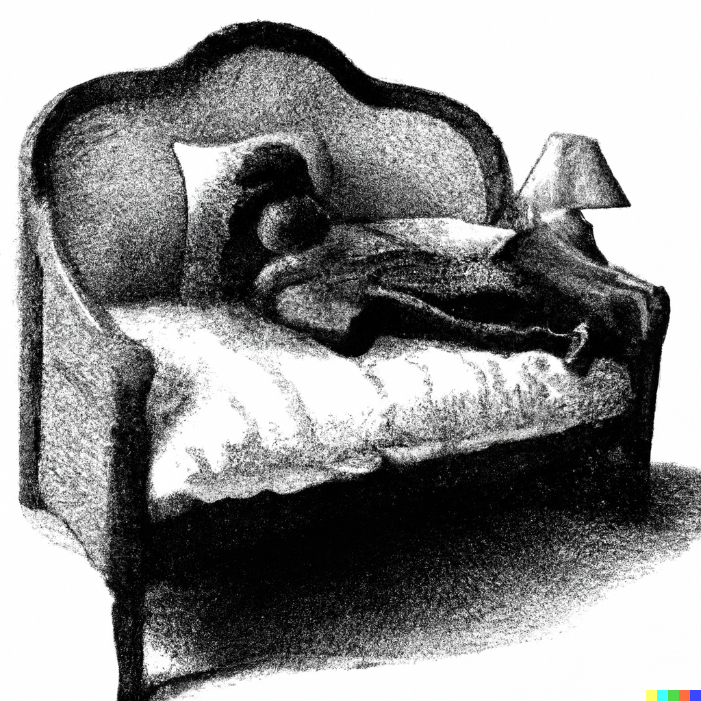

| [Back](../Naps/Naps1.md) | [Home](../index.md) | [Next ](../Naps/Naps3.md) |
--: | --: | --:

# Sleeper's Colloquy

|Description| Nap name|
------------|----------
|The pre-sleep nap at 10pm on the couch before you go to sleep-sleep in your bed|Listening at the Well, Certain You Heard a Voice|
|When you drink a beer mid afternoon and then drift off sitting at a desk|Turning the Clock to Five; Or, Drawing the Five of Clocks|
|On a plane to Wisconsin next to a big boy from Wisconsin|Indulging the Cheeseman’s Conspiracy|
|Took too much Adderall and your eyes start crossing so you take some ativan to chill and nap for 5 mins when it kicks in so your eyes stop crossing but you can’t nap longer cause there is still time release Adderall coursing through your veins|Returning the Gift of the Magi; Or, Indulging A Flash of Pharmacist’s Whimsy
|Adderall nap...|The Chemist’s Soft Conniption|
|The nap I’m about to take, come home from work, plan a nice supper, eat half a wheel of Brie on 4 crackers and fall asleep instead. Wake up and have to cook dinner at 10 pm so you’ll have lunch in the a.m. Get to bed too late and wake up tired. Also it’s very hot in the apartment and instead of turning the heat down I just took my shirt and bra off and am wearing sweatpants|Springing an Arizona Flat|
|A nap where you feel overwhelmed so you lay down and close your eyes but don’t actually sleep at all and just have anxiety for 20 minutes with closed eyes and then get up and pretend you feel rested enough to get back to work|Considering the Perspective of Lady Justice|
|--the nap that you don’t wake up from.|A whole family of naps fall within this larger classification, some common varieties being Drawing Helios’ Shade, Fishing for Virginia, and Renting an Attic Apartment. The larger family is called Non-Recurrent Repose.|
|And when you fall asleep at work with your eyes open?|Taking the Mannequin’s Wage|
|Post cheese plate wine nap ?|Taking the Curator’s Knee|
|When you’re driving home at 6:30am from an overnight shift and everyone else is driving to work and you stop at a light and you only blink, but the next thing you know you wake up drifting into cross traffic?|Matador’s Somnambulance|
|Going to a theatre alone to see a loud action movie, falling asleep ten to fifteen minutes in and waking up once things start happening|Glossed Whedon|

| [Back](../Naps/Naps1.md) | [Home](../index.md) | [Next ](../Naps/Naps3.md) |
--: | --: | --:

