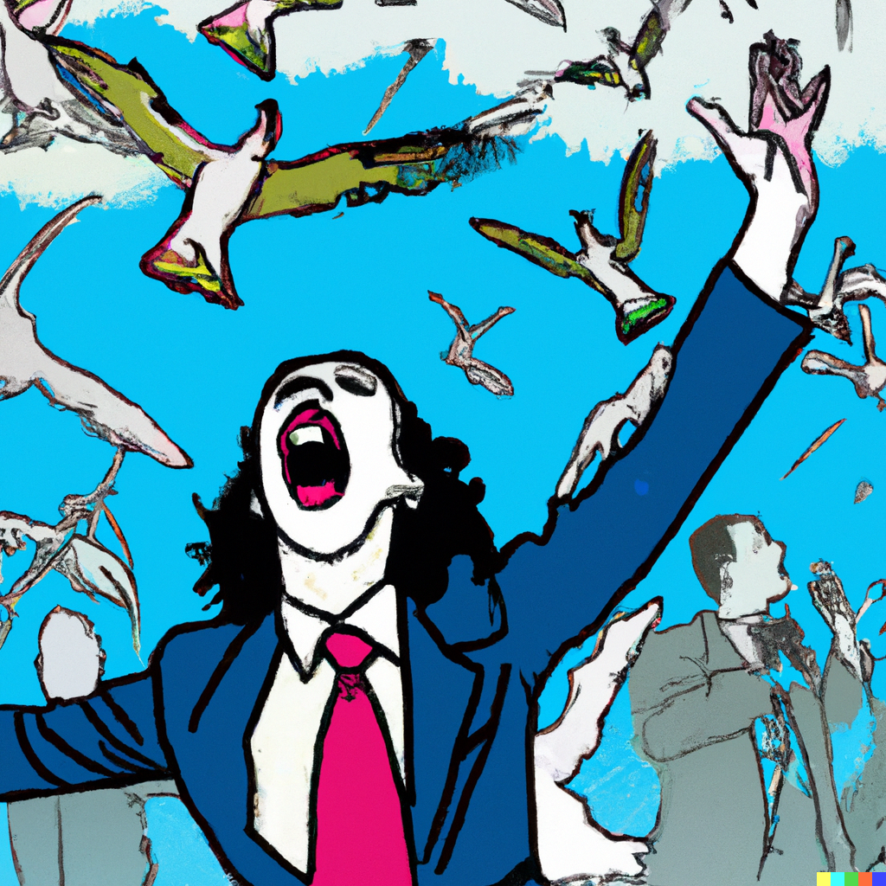

# Travis Cannon
> ### Writer, comic, third noun.
> #### Thanks for visiting my portfolio. Find here a selection of some of my writing across a few different formats, genres and registers. Each section has a brief introduction, the content and then a Lessons Learned section where I've recorded what was good (rose), what was difficult (thorn) and what I would do differently approaching the project again (seed). I hope you enjoy what you find here!     

## WORK! Everybody does it, why can't you? (2018)
##### Read this for: an idea of how I write satire, how I mix sincerity and humour, how I explore a character's worldview, an idea of how job-searching might look to an NPC in a FromSoftware game.

A six-part series of career advice for job-seekers commissioned by the late Brunch Club Comedy Blog, a blog run by an independent comedy production company. Emphasizes the importance of authenticity, being one's self, understanding one's self as something only temporarily granted by a high and unknowable authority, ignoring pro-canine propaganda, and most importantly being true to one's heart. Tonally, one should consider the tongue not just in the cheek but having started a settlement in the cheek and founded a bizarre arcane religion there.

### Contents
- [I. Who do you think you are?](/WEDIWCY/I.md)
- [II. You think you're better than everybody else?](/WEDIWCY/II.md)
- [III. What have you done that's so special?](/WEDIWCY/III.md)
- [IV. On whose authority?](/WEDIWCY/IV.md)
- [V. Who do you think you're talking to?](/WEDIWCY/V.md)
- [VI. What are you waiting for?](/WEDIWCY/VI.md)

Lessons learned 

 

**Rose**: This was a really gratifying project to work on. I was given a long leash to write whatever I wanted, and the sense of being trusted by the editors of the blog was very empowering even if the stakes weren't especially high. It was very creatively invigorating and stirred a strong desire to build an entire world around the strange, broken narrator of the pieces, but sadly there were bills to pay!

**Thorn**: Something I regret about this project is that I didn't have the resources to do quite as much multi-media trickery and hijinks as I would have liked to. I initially envisioned video components, audiolog-style guided meditations and (believe it or not) a painted comic portion. I knew that I wouldn't be able to execute at the level of quality that I wanted to with the time and resources that I had available though, so much of the vision was scaled back.

**Seed**: Given the opportunity to do it again, I'd like to have come at it more holistically instead of writing it on a per-post basis. The serialized format did produce some productive contraints, but I wonder how it might have gone differently had I a cleared vision of what I wanted the whole of it to look like.

## Crystal Warriors (2020)
##### Read this for: how I write dialogue, scene description and character relationships, some extremely scandalous puns and innuendos.

**Content Warning:** *explicit sexual references, jokes and descriptions.*

Written for Mindgeek’s gaming division (Nutaku) this is the scenario text for one of their first entirely in-house productions, a mobile RTS called Crystal Warriors. I was tasked with writing the scenario, dialogue, and tutorials, as well as the more explicit CG scenes. The central hook of the game was recruiting and training a harem of characters modeled after male adult film stars. The tone was meant to be humorous and light-hearted while also consistent with classical fantasy tropes.

A considerable but productive constraint on this project was that the game was going to be an asset swap of an existing game, meaning the scenario had to follow the existing arc of the base game and that the new characters would have dialogue at the same point as their analogs. This created interesting but not insurmountable challenges as I found ways to write conversations around “who’s-speaking-when” rather than “who’s-speaking-why”.  This is the reason the characters in this script retain the names of their female counterparts in the original game.
### Contents
- [I. 00 - 10: Introductions through to first boss](/CrystalWarriors/0010.md)
- [II. 11 - 20: Meeting new friends and forging on](/CrystalWarriors/1120.md)
- [III. 21 - 30: Through the tundra, up the mountain](/CrystalWarriors/2130.md)
- [IV. 31 - 40: Wildlife, wiled life, wild life](/CrystalWarriors/3140.md)

Lessons learned 

 

**Rose:** I loved working on this project. Coming up with quick tastes of unique characters was a really enjoyable exercise and plotting a slowly growing tenderness between the central triad was a surprisngly sweet experience.

**Thorn:** I regret that there wasn't better communication within the organization around what the goals, methods or status of this project was. I really would have liked to see it made into something more than a script, and I think it would have been a great prestige piece for the company.

**Seed**: Given the opportunity to do it again, I'd be more proactive about connecting with the people working on the project beyond my immediate team. It was one of the first times that Nutaku and the Paysites Creative team had collaborated, and there was still ambiguity around what our relationship with each other should be.

## Sleeper's Colloquy (2019)
##### Read this for: a sense of my ability to iterate on a theme, inject humor and whimsy into *tired* subject matter, and generally playful approach to creativity.

Let's call it an experiment in collaborative world-building. I solicited my friends and followers on Instagram to send me descriptions of types of naps, and told them I would tell them the True Name of that nap in exchange. What resulted was an extremely fun exercise in quickly, and repeatedly improvising in writing (two fields that I'd enjoyed apart but hadn't thought about trying in combination, very Reese's Peanut Butter Cups).

### Contents
- [Sleeper's Colloquy](/Naps/Naplist.md)

Lessons learned 

 

**Rose:** A real thrill and a fond memory of sharing my writing with my friends in a way that didn't feel quite so pompous as a reading or high-pressure as a stand-up performance. A great reminded that social media can be a tool for fun(!!) sometimes.

**Thorn:** The experimental nature of generating the naps, accepting descriptions from anyone who wanted to submit one, means theres sometimes a bleakness or sadness that can be hard to square with the jokeyness of the project. Perhaps a compelling contrast thought! 

**Seed**: I would love to make something more of this project than a table or an instagram slideshow. I've toyed with the idea of making a zine or chapbook, but wonder if I've waited too long for it to feel worthwhile.

## Monologues and Character Pieces

### Contents

##### Read these for: My sense of character and idiosyncracy, flair for the dramatic and beguiling, the word 'horse' a shocking number of times.

A trio of character studies and monologues written to be performed at comedy shows. 

### Contents
- [From Where I'm Calling (2017)](/Prose/FromWhereImCalling.md)
- [Everybody Came to See the Horses (2018)](/Prose/Horses.md)
- [Horace at the Wedding (2019)](/Prose/Horace.md)

Lessons learned

 

**Rose:** As always, I have a blast exploring the sad little corners of someone trying to hold it together. Someone who thinks they're maintaining but simply are not. These were all very fun to perform.

**Thorn:** As monologues the characters don't get to bounce off other personalities enough for my liking. A reminder of the positive friction of character and conflict.

**Seed**: What does it look like when these characters have to speak to one another? I want to see more of their worlds.
